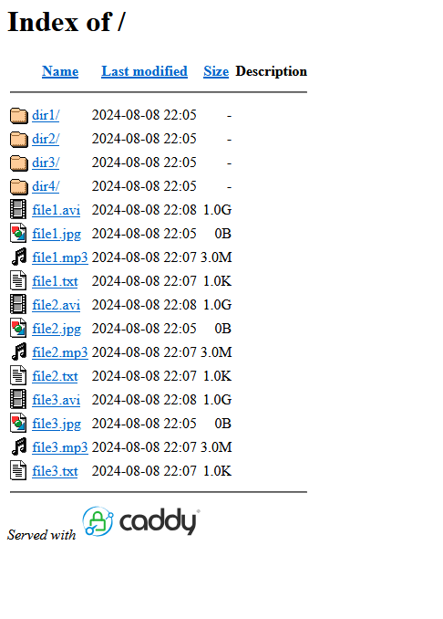

# apaddy
Caddy browse template that replicate the output from apache mod_autoindex for compability with kodi.
## Installation
Just copy the apaddy folder to the path you want to serve with caddy.
## Example Caddyfile
```
sub.domain.tld {
        root * /path/to/served/directory
        file_server {
                browse /path/to/served/directory/apaddy/apaddy_browse_template.html
        }
}

```
## Screenshot
